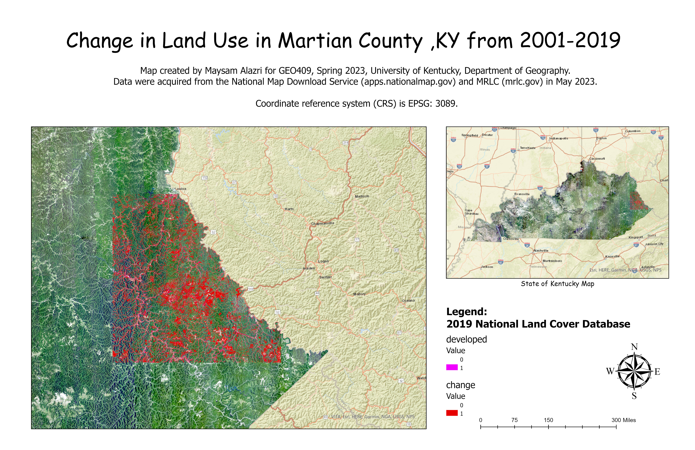

# lab06-Visualizing-Change

This project focuses on Martin County in the State of Kentucky. In fact, this area has been affected a lot due to the coal mining process over the years. However, in the map showen below I will just focuse on the land use changes in the county. 

   
Kentucky counties with selected land cover types – [Download geospatial PDF](land use change.pdf)

   
UKy central campus canopy model – [Download geospatial PDF](campus-canopy-model.pdf)

Map created by Maysam Alazri for GEO409, Spring 2023, University of Kentucky Department of Geography.
